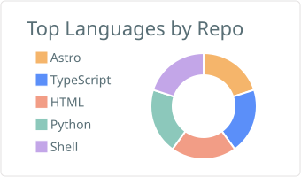

  

  # c0k0n

  computers · software · language · learning

   
   

  

## A little context

I spend a lot of time around computers and computer-related things, usually by making something small enough to understand end to end. The work here moves between web interfaces, language-oriented tools, command-line utilities, and data experiments.

I learn by shipping, comparing, testing, and writing down the edges. The projects are modest on purpose; the point is to leave behind something useful, inspectable, or a little clearer than it was before.

## Selected work

The five projects below are the current public shelf. Each one has a different reason for existing; the descriptions stay short so the links can do the deeper talking.

| Project | What it is | Visit |
| --- | --- | --- |
| [**Basirah — بَصِيرَة**](https://github.com/c0k0n/basirah) | A bilingual Islamic knowledge site for Myanmar Muslims, with selected Qur’an surahs, recitation audio, essential duas, and the Names of Allah in Burmese, English, and Arabic. | [Live site](https://basirah.pages.dev) · [Source](https://github.com/c0k0n/basirah) |
| [**Language Atlas**](https://github.com/c0k0n/languageatlas) | An offline-friendly field guide to **83 programming languages**, organized for filtering and comparison across kind, paradigm, typing, execution mode, platform, and runtime. | [Open the atlas](https://languageatlas.pages.dev) · [Source](https://github.com/c0k0n/languageatlas) |
| [**LSTM Trend**](https://github.com/c0k0n/lstm-trend) | A Streamlit forecasting experiment using Keras 3 on a PyTorch backend, with exploratory analysis, simpler baselines, interactive charts, and explicit limitations. | [Try the app](https://lstm-trend.streamlit.app) · [Source](https://github.com/c0k0n/lstm-trend) |
| [**hobun-ssg**](https://github.com/c0k0n/hobun-ssg) | A learning project built around Hono and Bun: an app pre-rendered to static HTML and served on Cloudflare Pages. | [Live site](https://hobun-ssg.pages.dev) · [Source](https://github.com/c0k0n/hobun-ssg) |
| [**update-go**](https://github.com/c0k0n/update-go) | A small Bash installer and updater for the Go toolchain on Linux and macOS, with checksum verification, preview, self-update, and uninstall modes. | [Read the script](https://github.com/c0k0n/update-go) |

## Working set

| Area | Tools that show up in the work |
| --- | --- |
| Web | Astro · Hono · TypeScript · HTML · CSS |
| Runtime and delivery | Bun · Cloudflare Pages · Streamlit |
| Data and ML | Python · Keras · PyTorch · scikit-learn · yfinance |
| Systems and tooling | Bash · Go · Git |

## How I tend to work

> Build something small enough to inspect. Compare it with a simpler baseline. Keep the limitations visible.

That usually means a fast interface, a command that explains itself, a dataset with understandable categories, or documentation that says what a project does **not** prove.

## GitHub signals

These cards answer two different questions: **how the profile is changing** and **which languages appear across its repositories**. The activity card is live; the language card is kept locally so its palette stays intentional.

  <picture><source media="(prefers-color-scheme: dark)" srcset="https://github-profile-summary-cards.vercel.app/api/cards/stats?username=c0k0n&theme=github_dark"><source media="(prefers-color-scheme: light)" srcset="https://github-profile-summary-cards.vercel.app/api/cards/stats?username=c0k0n&theme=default"></picture>
  <picture><source media="(prefers-color-scheme: dark)" srcset="./assets/repos-per-language-dark.svg"><source media="(prefers-color-scheme: light)" srcset="./assets/repos-per-language-light.svg"></picture>

## Tqsm for stopping by

The repositories are the best place to see what I am exploring now. If something here is useful, feel free to borrow the idea, open an issue, or follow the thread back to the source.

  ( ͡° ͜ʖ ͡°) • (o^^o)

