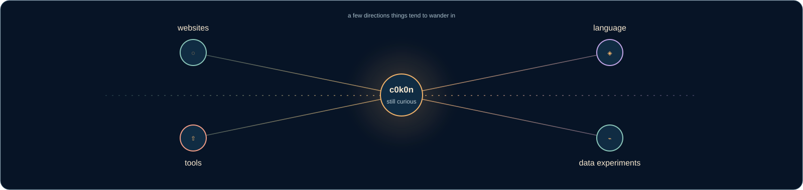

## c0k0n

computers · software · language · learning

I spend a lot of time around computers and computer-related things. I’m still
figuring most of this out as I go, making small websites and tools along the way.

<table>
<tr>
<td align="center" width="25%"><strong>04</strong> small projects</td>
<td align="center" width="25%"><strong>02</strong> live web experiences</td>
<td align="center" width="25%"><strong>83</strong> languages in the atlas</td>
<td align="center" width="25%"><strong>164</strong> Basirah entries</td>
</tr>
</table>

## A small shelf

<table>
<tr>
<td width="50%" valign="top">

### ◌ [Basirah](https://github.com/c0k0n/basirah)

**بَصِيرَة** · a bilingual Islamic knowledge site with selected Qur’an surahs, recitation, essential duas, and the Names of Allah in Burmese, English, and Arabic.

</td>
<td width="50%" valign="top">

### ◈ [Language Atlas](https://github.com/c0k0n/languageatlas)

An offline-friendly field guide to programming languages, built for browsing, filtering, comparing, and changing your mind.

</td>
</tr>
<tr>
<td width="50%" valign="top">

### ⌁ [LSTM Trend](https://github.com/c0k0n/lstm-trend)

An ML forecasting experiment. The model is there, but so are the naive baselines, the awkward questions, and the limitations.

</td>
<td width="50%" valign="top">

### ⇧ [update-go](https://github.com/c0k0n/update-go)

A small Go installer and updater for Linux and macOS. It checks the checksum before touching the existing installation.

</td>
</tr>
</table>

## On the desk

<table>
<tr>
<td width="25%" valign="top"><strong>web</strong> Astro · TypeScript · CSS</td>
<td width="25%" valign="top"><strong>runtime</strong> Bun · Cloudflare · Linux</td>
<td width="25%" valign="top"><strong>data</strong> Python · Keras · PyTorch</td>
<td width="25%" valign="top"><strong>systems</strong> Go · Shell · Git</td>
</tr>
</table>

## Still figuring things out

<table>
<tr>
<td width="50%" valign="top">

• Data Analytics  
• Web Frameworks

</td>
<td width="50%" valign="top">

• Small utilities to save everyone's day  
• New Techs and New Stuffs

</td>
</tr>
</table>

## Learning with AI

These are small learning projects. I explored and developed them while learning and working alongside AI. It is simply part of how I study, test ideas, and make things now.

<b>Some notes</b>

I like software that gives you a good surface to think on: a page that loads quickly, a command that tells you what it is doing, a dataset whose categories make sense, or documentation that is honest about the edges of a project.

I also like the less practical parts of computers: new interfaces, tiny utilities, strange file formats, command-line stuffs, and the feeling of understanding one more layer than I did yesterday.

 

Tqsm for stopping by ٩(◕‿◕)۶

