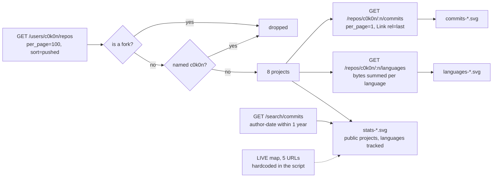

<div align="center">
  

  # c0k0n

  <sub>computers · software · language · learning</sub>

  <br />

  <picture>
    <source media="(prefers-color-scheme: dark)" srcset="./assets/tagline-dark.svg" />
    <source media="(prefers-color-scheme: light)" srcset="./assets/tagline-light.svg" />
    
  </picture>
</div>

## About

Everything here is small enough to read end to end. This repository is the profile page plus
the one script that generates its graphics.

<p align="center">
  <picture>
    <source media="(prefers-color-scheme: dark)" srcset="./assets/stats-dark.svg" />
    <source media="(prefers-color-scheme: light)" srcset="./assets/stats-light.svg" />
    
  </picture>
</p>

## The shelf

<p align="center">
  <picture>
    <source media="(prefers-color-scheme: dark)" srcset="./assets/commits-dark.svg" />
    <source media="(prefers-color-scheme: light)" srcset="./assets/commits-light.svg" />
    
  </picture>
</p>

| Project | What it is | Links |
| --- | --- | --- |
| [**basirah** — بَصِيرَة](https://github.com/c0k0n/basirah) | Qur'an surahs with recitation, duas and the Names of Allah, in Burmese, English and Arabic. Astro + PWA. | [Live](https://basirah.pages.dev) · [Source](https://github.com/c0k0n/basirah) |
| [**languageatlas**](https://github.com/c0k0n/languageatlas) | Offline field guide to 83 programming languages, filterable across kind, paradigm, typing, execution, platform and runtime. | [Live](https://languageatlas.pages.dev) · [Source](https://github.com/c0k0n/languageatlas) |
| [**job-tracker**](https://github.com/c0k0n/job-tracker) | Application pipeline with interviews, funnel and velocity analytics, on SvelteKit 5 + Cloudflare D1. | [Live](https://job-tracker.sanctum.workers.dev) · [Source](https://github.com/c0k0n/job-tracker) |
| [**lstm-trend**](https://github.com/c0k0n/lstm-trend) | LSTM stock forecasting on Keras 3, with simpler baselines and the limitations written down. | [Live](https://lstm-trend.streamlit.app) · [Source](https://github.com/c0k0n/lstm-trend) |
| [**hobun-ssg**](https://github.com/c0k0n/hobun-ssg) | Learning Hono and Bun by pre-rendering a site to static HTML on Cloudflare Pages. | [Live](https://hobun-ssg.pages.dev) · [Source](https://github.com/c0k0n/hobun-ssg) |
| [**update-go**](https://github.com/c0k0n/update-go) | One-command Go toolchain installer and updater for Linux and macOS, with checksum verification. | [Source](https://github.com/c0k0n/update-go) |
| [**cv-resume-consolidation**](https://github.com/c0k0n/cv-resume-consolidation) | Markdown in, ATS-safe one-page PDF and matching DOCX out. | [Source](https://github.com/c0k0n/cv-resume-consolidation) |
| [**galaxy-legend-extractor**](https://github.com/c0k0n/galaxy-legend-extractor) | All 194 SSS heroes reverse-engineered into an LLM-ready dataset. | [Source](https://github.com/c0k0n/galaxy-legend-extractor) |

<p align="center">
  <picture>
    <source media="(prefers-color-scheme: dark)" srcset="./assets/languages-dark.svg" />
    <source media="(prefers-color-scheme: light)" srcset="./assets/languages-light.svg" />
    
  </picture>
</p>

## Working set

<p align="center">
  <picture>
    <source media="(prefers-color-scheme: dark)" srcset="./assets/stack-dark.svg" />
    <source media="(prefers-color-scheme: light)" srcset="./assets/stack-light.svg" />
    
  </picture>
</p>

This chart is the exception: its four columns and 26 chips are a hardcoded list at the top of
`stack()` in [`tools/build-assets.mjs`](tools/build-assets.mjs), not API data. Every other
number on this page comes from the GitHub API.

## How this page is built

<p align="center">
  <picture>
    <source media="(prefers-color-scheme: dark)" srcset="./assets/file-map-dark.svg" />
    <source media="(prefers-color-scheme: light)" srcset="./assets/file-map-light.svg" />
    
  </picture>
</p>

<p align="center">
  <picture>
    <source media="(prefers-color-scheme: dark)" srcset="./assets/how-it-works-dark.svg" />
    <source media="(prefers-color-scheme: light)" srcset="./assets/how-it-works-light.svg" />
    
  </picture>
</p>

Where each chart's numbers come from:


```mermaid
flowchart LR
  A["GET /users/c0k0n/repos<br/>per_page=100, sort=pushed"] --> B{"is a fork?"}
  B -->|yes| X["dropped"]
  B -->|no| C{"named c0k0n?"}
  C -->|yes| X
  C -->|no| D["8 projects"]
  D --> E["GET /repos/c0k0n/:n/commits<br/>per_page=1, Link rel=last"]
  D --> F["GET /repos/c0k0n/:n/languages<br/>bytes summed per language"]
  E --> G["commits-*.svg"]
  F --> H["languages-*.svg"]
  D --> I["stats-*.svg<br/>public projects, languages tracked"]
  J["GET /search/commits<br/>author-date within 1 year"] --> I
  K["LIVE map, 5 URLs<br/>hardcoded in the script"] -.-> I
```

### Running it

Node 20.11+ — the script uses `import.meta.dirname` and top-level `await`. There is no
`package.json` and nothing to install.

```bash
node tools/build-assets.mjs                    # uses `gh auth token`
GH_TOKEN=$(gh auth token) node tools/build-assets.mjs
```

It reads nothing from disk, writes all 11 generated files into `assets/`, prints the file list
plus a language breakdown, and throws on the first failed request. Each run overwrites the
generated charts outright; the four hand-drawn diagrams in the file map are never touched.

<div align="center">
  <sub>(..◜ᴗ◝..)</sub>
</div>
